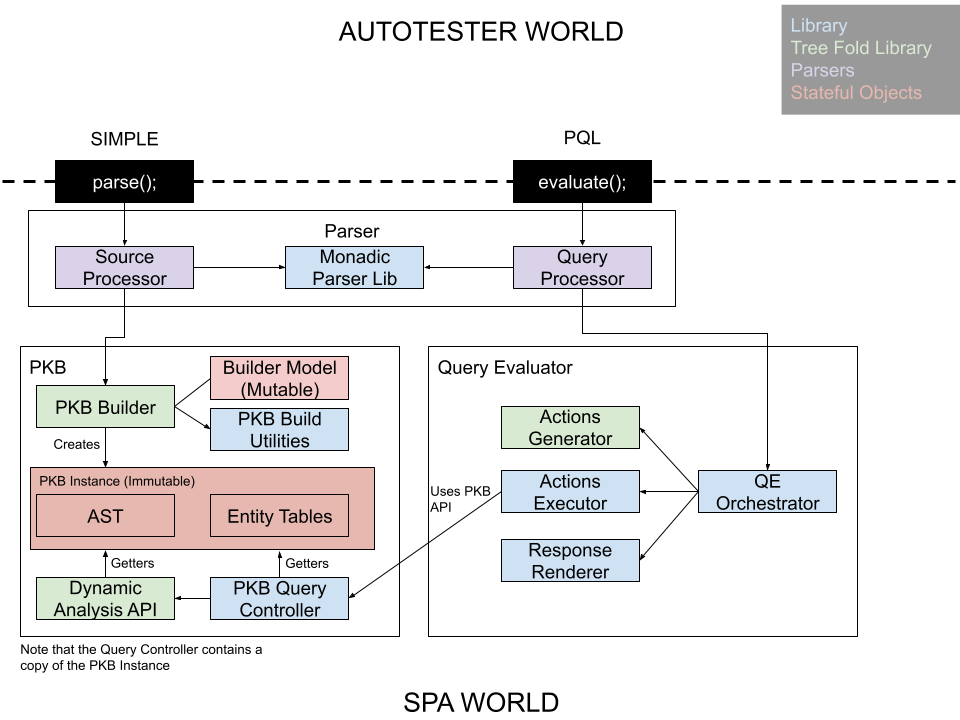

# CS3203 Software Engineering Project
**AY20/21 Semester 2**

**Iteration 1 Project Report**

**Team07**

Matriculation No. | Email
-|-
A0125431U | a0125431@u.nus.edu
A0184679H | e0313668@u.nus.edu
E0308994 | e0308994@u.nus.edu
A0171374E | e0200944@u.nus.edu
E0196816 | e0196816@u.nus.edu
E0174832 | e0174832@u.nus.edu

# Scope
## Features Implemented
### SIMPLE Parser
- stateful combinator parser framework
- pretty printing of parse error
- validation check for unique procedure names
- SIMPLE parser according to iteration 1 spec
### PQL Parser
- PQL parser according to iteration 1 spec
- PQL validation according to iteration 1 spec
### PKB
TODO
### Query Evaluator
TODO
## Bonus Features from full BasicSPA
### SIMPLE Parser
- call statements
- validation check call statements on procedures that exists
- parser program as multiple procedures
# Development Plan
## Project Roles
Table 1 below describes the roles of each team member and their respective duties. 
Title | Role | Assignment
-|-|-
Team Lead | Facilitator | Zong Sien|
Tech Lead 1 | Architecture, Integration | Haliq
Tech Lead 2 | Integration, Systm Testing | Pakorn
Documentation | Editor | Bo Hao, Dian Hao
Member | - | Chuan Kai

Table 1: Roles 

## Project Management Tools
Team 07 uses a variety of different tools to assist them during the project’s development. The following subsections describe why each tool was chosen and their uses. 

### Communications
Microsoft Teams was used as the official form of communication with the teaching team. Additionally, online meetings were carried out on this platform during our group discussions. Most importantly, Teams provided a central platform that integrates the communication and storage of documents used for our project which makes is a convenient choice for discussions.  

### Progress Tracking
GitHub’s Project’s board was used to track the progress of issues. Team 07 chose the Kanban template which categorises the issues into 4 main categories, to do, in progress, done issues and done pull requests (PRs). The closely integrated nature of this tool and GitHub issues makes it a good choice for progress tracking. Additionally, the Project board is minimal but functional which reduces hassle of introducing alternative platforms into the workflow. 

### Code Workflow
GitHub was used as the code repository as stipulated by the project’s requirement. Below shows an example of Team 07’s branching workflow. 

``` 
master branch 
├── iteration 1 
│    ├── mini-iteration 1  
│    │   ├── issue #001 
│    │   ├── issue #002  
│    │   └── ...   
│    └── ... 
├── iteration 2 
└── ... 
``` 

## Documentation
Teams was used as a platform for documentation. The online Microsoft Word integration enabled members to collaborate on the documentation simultaneously. Thereby ensuring that the API documentations are up to date for other members to refer to. Additionally, Teams provided functionality as an online storage to host our documentation materials without the hassle of opting for alternatives such as Google’s suite of products (Google Docs, Google Drive, etc) 

## Project Plan

### Software Development Lifecycle (SLDC)
Team 07 practices the iterative breadth-first model. This mode of development allows components to be developed in parallel while still allowing flexibility for change. The 3 main iterations are further broken down into mini iterations to facilitate tracking of development progress. The iteration 1 breakdown can be found in 2.3.3 Iteration 1 Schedule. 

### Task Assigment
There are 3 + 1 categories of tasks that are split amongst team members. Each task is assigned based on expertise and workload of task. Table 2 below describes the assigned task to each member. 

| S/N  | Category         | Task                         | Assignment     |
|------|------------------|------------------------------|----------------|
| 1    | General          | Design system architecture   | Haliq, Pakorn  |
| 2    |                  |                              | Haliq, Pakorn  |
| 4    | Parser           | Design parser library        | Haliq          |
| 5    |                  | Design SIMPLE parser         | Haliq          |
| 6    |                  | Design PQL parser            | Zong Sien      |
| 7    | PKB              | Design PKB Builder           | Pakorn         |
| 8    |                  | Design PKB Instance          | Pakorn         |
| 9    |                  | Design PKQ Query Controller  | Dian Hao       |
| 10   | Query Evaluator  | Design Query Orchestrator    | Chuan Kai      |
| 11   |                  | Design Actions Generator     | Chuan Kai      |
| 12   |                  | Design Actions Executor      | Bohao          |
| 13   |                  | Design Response Renderer     | Bohao          |

Table 2: Task Assignment 

### Iteration 1 Schedule
The duration of each mini iteration is 7 days. For iteration 1, there is a single design phase (mini iteration 0) and 4 mini iterations. The number of days per mini iteration aligns with the number of weeks before the deadline which serves as a natural fit for the split. Additionally, this provides flexibility for members to work on the project on their own free time during the week. Moreover, Team 07 had implemented a Continuous Integration (CI) pipeline that executes test using the Catch 2 testing framework. This ensures that no regression occurs with each pull request (PR) merge into the main branch during integration. 

The objectives of each mini iteration are as follows: 
- Mini iteration 0: To define overall architecture of components. 
- Mini iteration 1: To define and implement data structures. 
- Mini iteration 2: To implement & test components. 
- Mini iteration 3: To implement & test components. 
- Mini iteration 4: To integrate and test components. 

| Mini Iteration  | Activity                                                                                                      | Assignment                   |
|-----------------|---------------------------------------------------------------------------------------------------------------|------------------------------|
| 0               | Define component API                                                                                          | All                          |
|                 | Design system architecture, including component and sub-components, interaction between components            | Haliq, Pakorn                |
| 1               | Define data structures for AST and Query Object                                                               | Zong Sien                    |
|                 | Implement monadic parsing library                                                                             | Haliq                        |
|                 | Implement higher order function for Query Object traversal                                                    | Chuan Kai                    |
|                 | Define data structures for PKB entries                                                                        | Dian Hao                     |
|                 | Define data structure for holding PKB entries (db)                                                            | Pakorn                       |
|                 | Define data structures for query actions (query logic)                                                        | Bohao                        |
| 2               | Create AST stub for traversal team to start development (can use stubs as test cases later to check parsers)  |                              |
|                 | Create Query object stub for action and PKB for query engine to start development (can use for tests after)   | Zong Sien                    |
|                 | Define SIMPLE grammar and validation rules                                                                    | Haliq                        |
|                 | Define PQL grammar and validation rules                                                                       | Zong Sien                    |
|                 | Implement & test PKB entry generation part 1                                                                  |                              |
|                 | Implement & test actions generation part 1                                                                    | Chuan kai                    |
|                 | Design query engine for actions + PKB interaction + presenting data to user part 1                            |                              |
| 3               | Implement & test SIMPLE Parser                                                                                | Haliq                        |
|                 | Implement & test PQL Parser                                                                                   | Zong Sien                    |
|                 | Continue with PKB entry generation part 2                                                                     |                              |
|                 | Continue with actions generation part 2                                                                       | Chuan kai                    |
|                 | Start writing documentation                                                                                   | All                          |
| 4               | Implement system and acceptance tests.                                                                        | Pakorn, Haliq, Dian Hao      |
|                 | Exploratory testing                                                                                           | Bohao, Zong Sien, Chuan Kai  |
|                 | Continue with documentation                                                                                   | All                          |

Table 3: Mini Iteration 1 Activity Plan 

# SPA Design
## Overview

This components in this diagram corresponds to the grouping of functions and stateful objects together rather than components in an OOP sense.

We have three core components
- Parser
- PKB
- Query Evaluator

Both PQL and SIMPLE parsers use the same parser combinators framework to perform parsing, thus a shared library. Source processor transforms SIMPLE source string to an `TNode` AST whilst query processor transforms PQL source string to a `QueryMap` object. The processors also perform validations on their objects before passing to their consumers.

The `TNode` is consumed by an instance of `PKBBuilder` whilst the `QueryMap` is consumed by `QueryEvaluator`.

The `PKBBuilder` builds a `PKBInstance` which is made up of entity tables and a reference to the original AST.

The `QueryEvaluator` generates actions (objects describing interaction with PKB Query Controller and composing data returned from it) via the actions generator. These actions are then passed to the actions executor which makes calls to PKB Query Controller. The PKB Query Controller looks up the `PKBInstance` to collect the data requested by the action.

The data received is then composed and formatted in the response renderer sub component which then returns it back to the query evaluator.
## Design Patterns
We used the facade pattern extensively. To keep the interaction between query evaluation and PKB localized PKB Query Controller serves as a facade rather than interacting with the `PKBInstance` directly.

The `PKBBuilder` is also a facade to the SIMPLE parser in which the parser need not know about the `PKBInstance` that corresponds to the AST. Likewise the query evaluator to the query processor.

The `PKBBuilder` also corresponds to the factory pattern so that we can easily extend to work with multiple SIMPLE source code and not store the PKB as a global state.

Likewise the `ActionsGenerator` serves as a factory of *information packets* to interact with the PKB rather than coupling the logic of forming the results tightly with the interaction with the PKB Query Controller.
## Components

### Parser
We approached parsing with a recursive descent approach via the use of parser combinators where a combinator is simply a function that takes a program state, mutates the state and returns an object based on the parsed content. 

#### State

The fields of the state object is as follows: 
```
int i; 
std::string *source; 
int curStmtNum; 
std::vector<ParseException> excps; 
```

The state holds a pointer to the string of the source code we are parsing via `*source` and has an index `i` pointing at the next character to consume. It also has a `curStmtNum` used by SIMPLE parser to keep track of the statement numbers to be assigned to newly parsed statements. And finally a vector of ParseExceptions `excps` representing the stack of failures when they occur so that the user knows every point in the call that failed. 

#### Combinator Parser
The simplest combinator is the `charPredicate` that tests the character at the index against a predicate, if it passes it will advance the index in the state and returns the character otherwise throw an exception.

Then there is the `stringPredicate` combinator that repeatedly applies the `charPredicate` until a failure occurs, and then resets the state back to just before the failure.

This method of capturing failure and reset the state, is used heavily. It can be used for repetition checking as in `stringPredicate` or it can be used to use an alternative parser if one fails.

Another parser combinator used a lot is the `stringMatch` which matches the character in the source at index position to the characters in sequence in the string argument. E.g. `stringMatch(s, "hello")` matches the source code `hellothere` up until before the character `t`.

With these primitive combinators, we can build a parser for PQL and SIMPLE.

#### Left Recursion

In the SIMPLE grammar, we encountered left recursive grammar for `expr` and `term`. We worked around the problem by breaking the non terminal into two e.g. `expr` and `expr_1`.

Instead of `expr :- expr ('+'|'-') expr | term`, we designed

```
expr :- term expr_1
expr_1 :- ('+'|'-') term expr_1 | e
```

where `e` is the empty string. We did a similar approach for `term`.

#### Pretty Printing Errors

When throwing `ParseException`s the parser only has the index value of the state, meaning the index in the source code. However the pretty printing is able to print out the exact line where the error occurs and for each `ParseException` list down its line number and column number conveniently for the user to lookup and make changes.

This is done by the `ParserMapper` class that is constructed with an argument of pointer to the source code string. On initialization the object calculates the index value at the beginning of each line. This is done by detecting the `\n` character.

The `get_line` function returns the line number in the source code given the index of the source code string. This is done with binary search, in the list of beginning line indices. When the upper bound and lower bound swap breaks their order, it means the lowest bound is the line number.

There are also convenient functions that generate the string and caret string pointing to the character given the index. These functions are used by the pretty printer.

### PKB
TODO
### Query Processor
TODO
# Testing
## Unit Testing
### SIMPLE
Unit testing is done by constructing an AST via TNode constructors and comparing if that is the same as the AST generated by the parser. Unit testing is very easy for the parser due to the parser combinator framework. We can test each parser on its own, from the most primitive up to the ones composed of other more complex parsers.
### PKB
### Query Evaluator
## Integration Testing
## System Testing
## Any other Testing
# Extensions to SPA
# Coding & Documentation Standards
## Coding Standards
## Documentation Standards
# Discussion
# Appendix